# Журнал

## Содержание
1. <a name="bkg-check">Исследование возможного фона</a>
1. <a name="fit">Фит</a>
1. <a name="cross_section">Сечение</a>

## [Исследование возможного фона](#bkg-check)
Вопрос, как распределён фон по параметру `x1`, т.к. по распределению по этой переменной теперь производится фит и определяется число сигнальных событий?

* Физический фон

Чтобы рассмотреть, как распределён физический фон, я смоделировал три точки с энергиями пучка 550, 700 и 950 МэВ (с настройками для сезона HIGH19) в мультиадронном генераторе: для этих точек произвёл свои стандартные отборы и посмотрел, сколько фоновых событий остаётся перед моментом фитирования.

На картинке ниже изображены распределения отобранных событий по параметру `x1` для трёх точек по энергии согласно мультиадронному генератору. Оранжевыми точками показано распределение по всем отобранным событиям (KSKL + Bkg, т.е. сигнал + фон), синие точки — только фоновые процессы, зелёным цветом выделена область, в которой я фитирую данное распределение (от -40 до 20). 
На картинке справа снизу показано отношение количества сигнальных событий к общему числу событий в диапазоне фитирования для трёх точек по энергии, видно, что отношение довольно высокое, хотя снижается с ростом энергии из-за увеличения количества фоновых процессов с KS. 
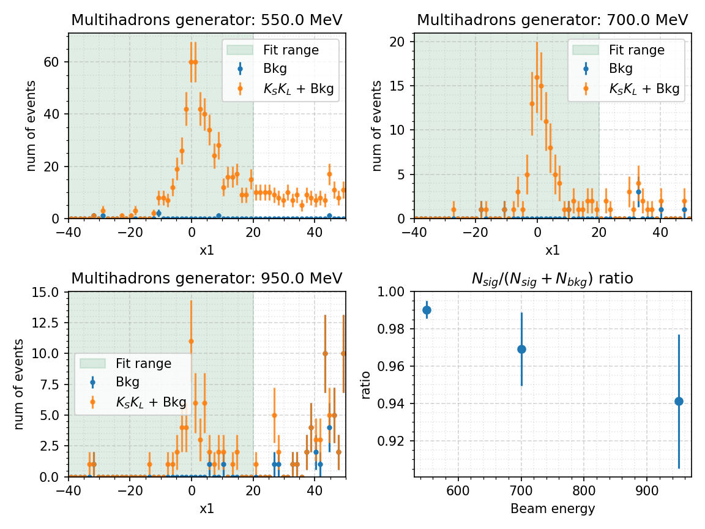
из картинки выше видно, что фоновые процессы максимально дают поправку в 6% от общего числа событий.

* Распределение по углу α (мультиадронный генератор)

Интересно рассмотреть, как фоновые процессы распределены по углу α — углу между радиус-вектором,соединяющим место встречи пучков с вершиной распада KS, и направлением импульса KS в r-φ-плоскости.

По этому параметру у меня стоит отбор `cos(α) > 0.8`, или, эквивалентно `α < 0.64`. 

На картинке ниже показаны распределения событий по углу α для трёх точек по энергии для моделирования с мультиадронным генератором.
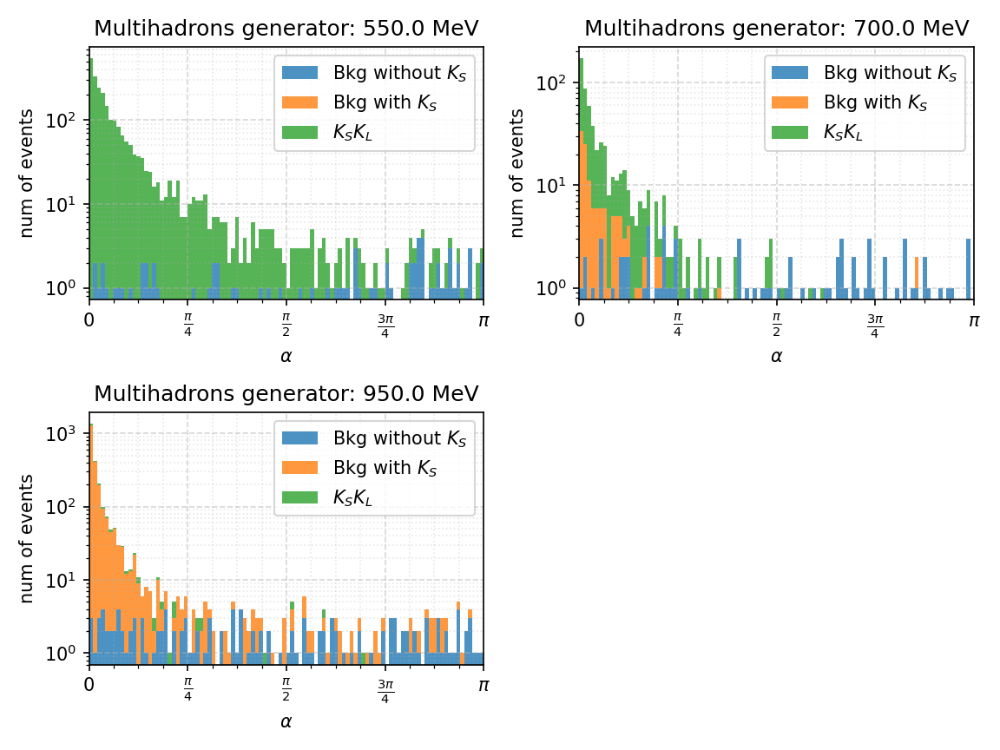
Из распределений событий видно, что фон для процессов без KS распределён равномерно по углу, а фон, как логично было ожидать, для процессов с KS, как и изучаемый процесс KSKL пикуется около нуля.

* Распределение по углу α (эксперимент)

Теперь рассматриваю то же самое распределение событий по углу α для экспериментальных данных (на примере четырёх точек из сезона HIGH19)

На картинке ниже показаны распределения событий по углу α для четырёх точек по энергии для эксперимента (синий) и моделирования (оранж.), линией показано условие отбора.
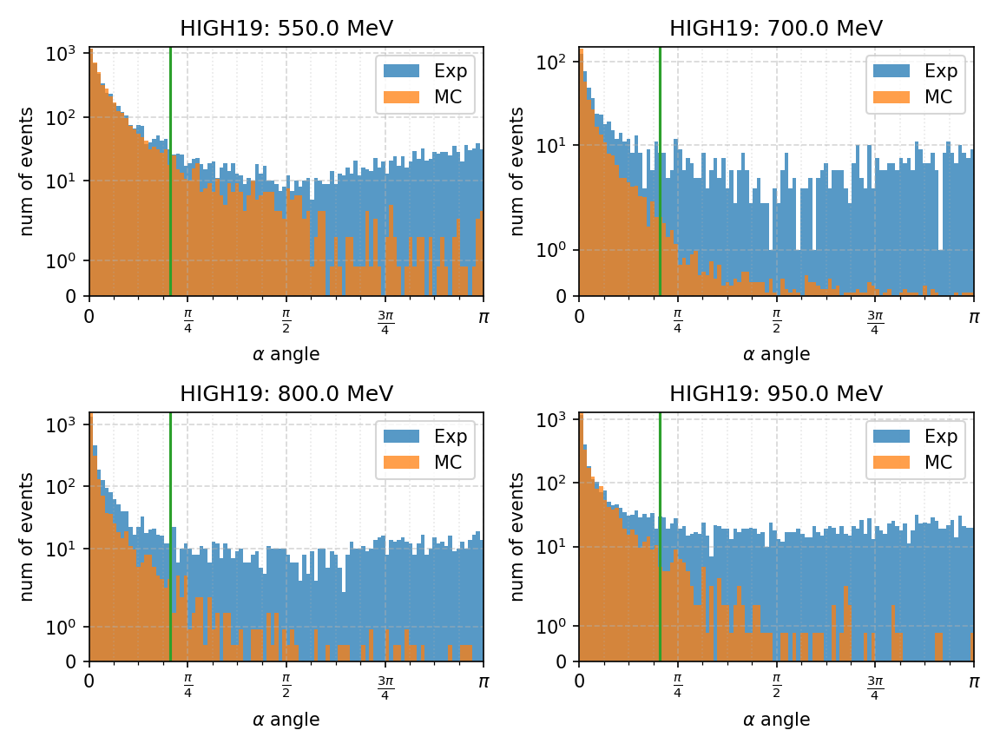
немного смущает распределение экспериментальных событий в точке 550 МэВ (левый верхний рисунок), т.к. наблюдается не очень понятный рост от π/2 к π.

Можно предположить, что в выбрасываемой критерием отбора области (α > 0.64), по лежит фон от процессов без KS и видимо нефизический фон (условно, для двух электронов случайно записанных в KS наверное нет выделенного направления по α, если так, то они должны быть распределены равномерно на этих рисунках).

Если так, то распределение событий из выбрасываемой области по параметру `x1` показывает, как распределена эта категория фона.

На рисунке ниже показаны распределения событий по параметру `x1` для событий из областей `α < 0.64` (оранж.), `α > 0.64` (синий) для четырёх точек из эксперимента HIGH19.
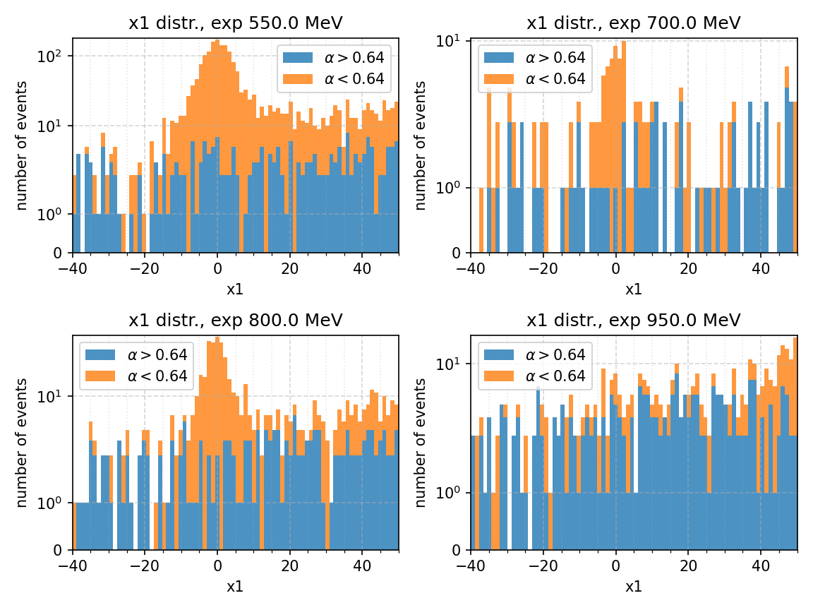
Видно, что события из выбрасываемой области распределены равномерно, соответственно, можно предположить, что оставшийся фон данного типа будет также распределён равномерно.

Как вывод, фоновые процессы без KS распределены равномерно по `x1` в фитируемой области, а фоновых событий процессов с KS хотя и немного, но их распределение должно расти с параметром `x1`, поэтому я решил фитировать фон линейной функцией.

## [Фит](#fit)

Распределение событий по параметру `x1` аппроксимировалось функцией *f* для сигнала, показанной на рисунке снизу и линейной функцией (kx+b) для фона

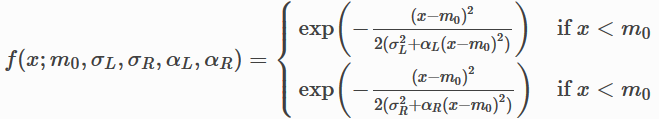

Примеры фитов для эксперимента и моделирования представлены на рисунках снизу:

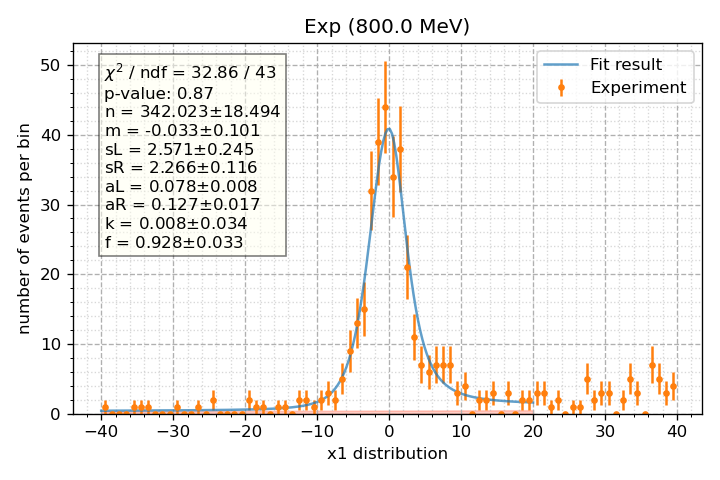 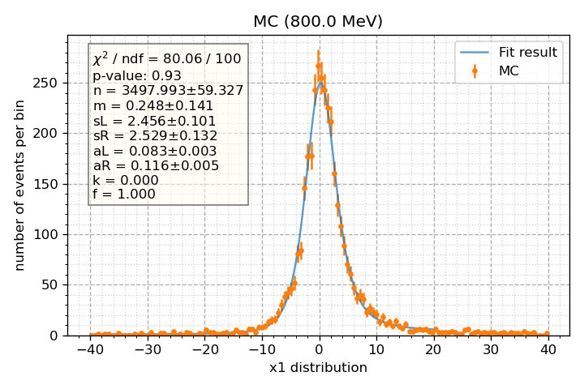 

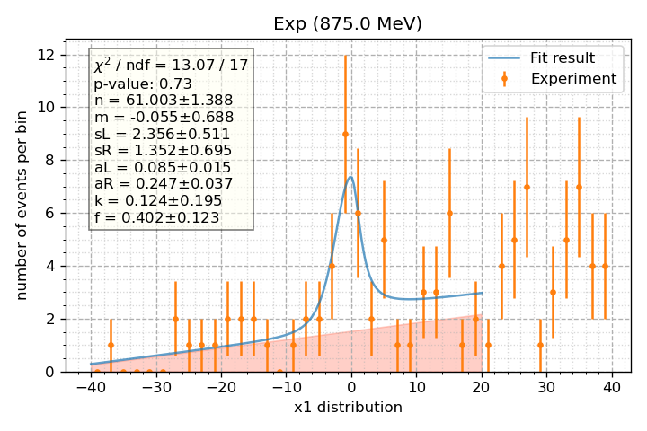 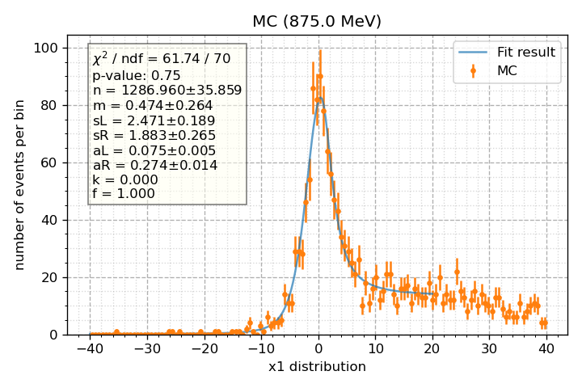 

## [Сечение](#cross_section)

На текущий момент переобработаны данные сезонов 2011 и 2019 гг. 
Результаты измерения сечения показаны на рисунке снизу:
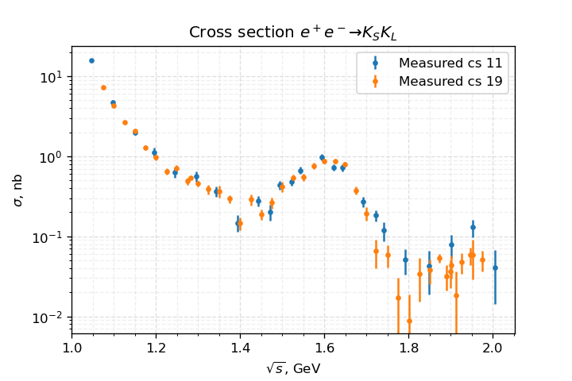

Видно, что в целом сечения согласуются, дальше планирую посмотреть 2012, 2017 (самая долгая часть - сделать моделирование)

## [Журнал](#journal)

**12.01** удалил кат `trho`, т.к. он высекает довольно большую область, посмотрю, что из этого выйдет

Проверил влияние этого ката на мультиадронном генераторе: результаты на картинках ниже

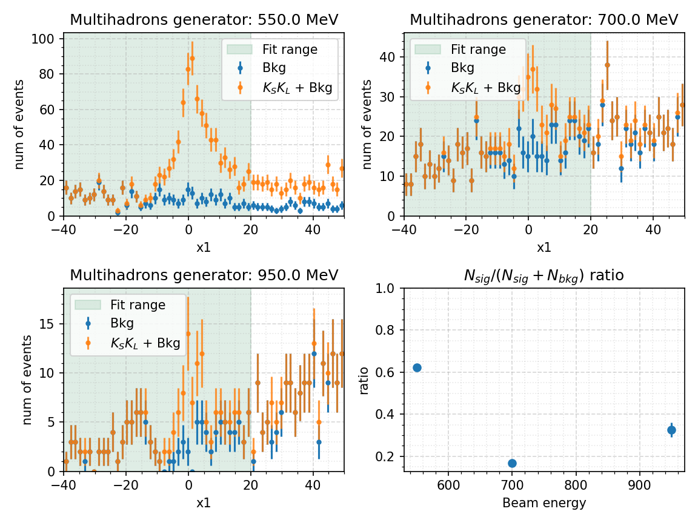
Верхняя картинка показывает соотношение сигнал/(сигнал + шум) для стандартных отборов, нижняя картинка - для отборов без ката на `trho`.
Видно, что соотношение значительно уменьшается при удалении ката, поэтому он важен и я возвращаю его на место.